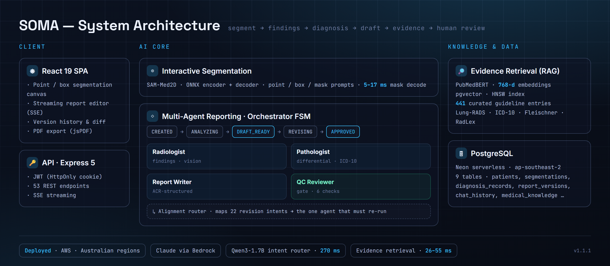
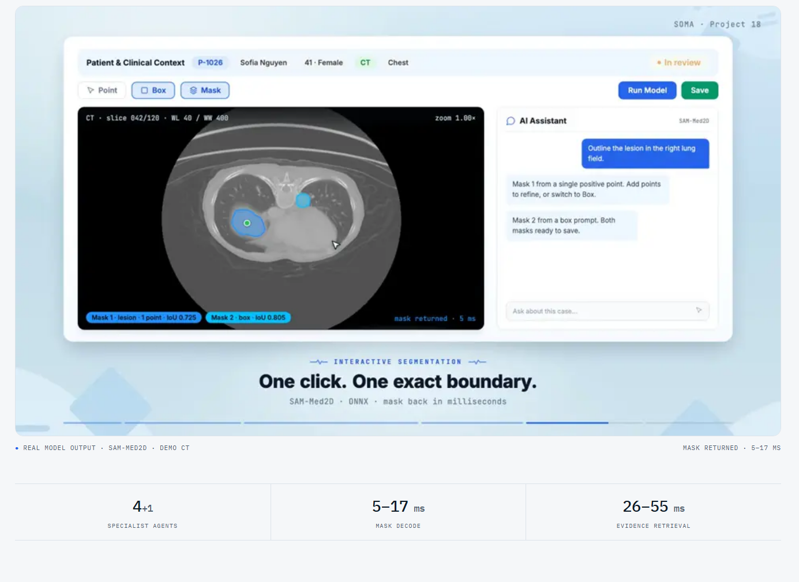
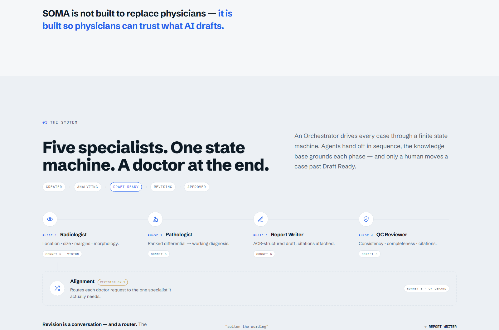
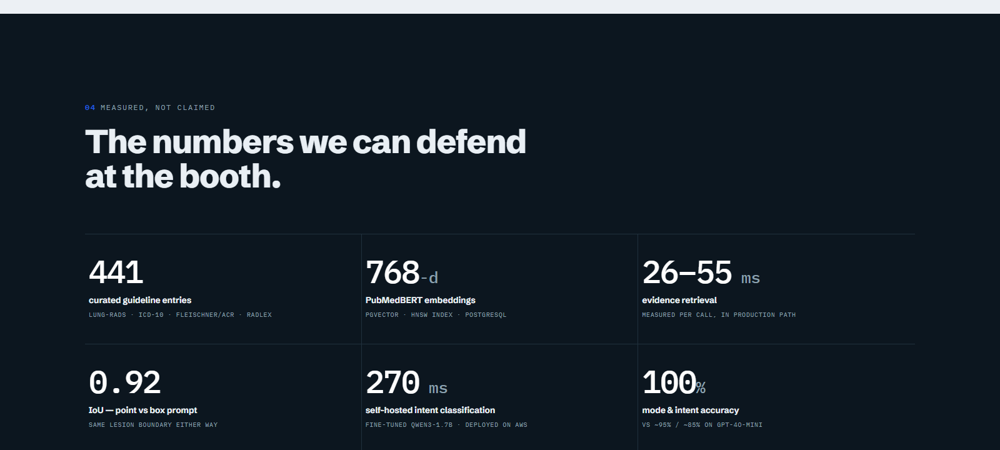
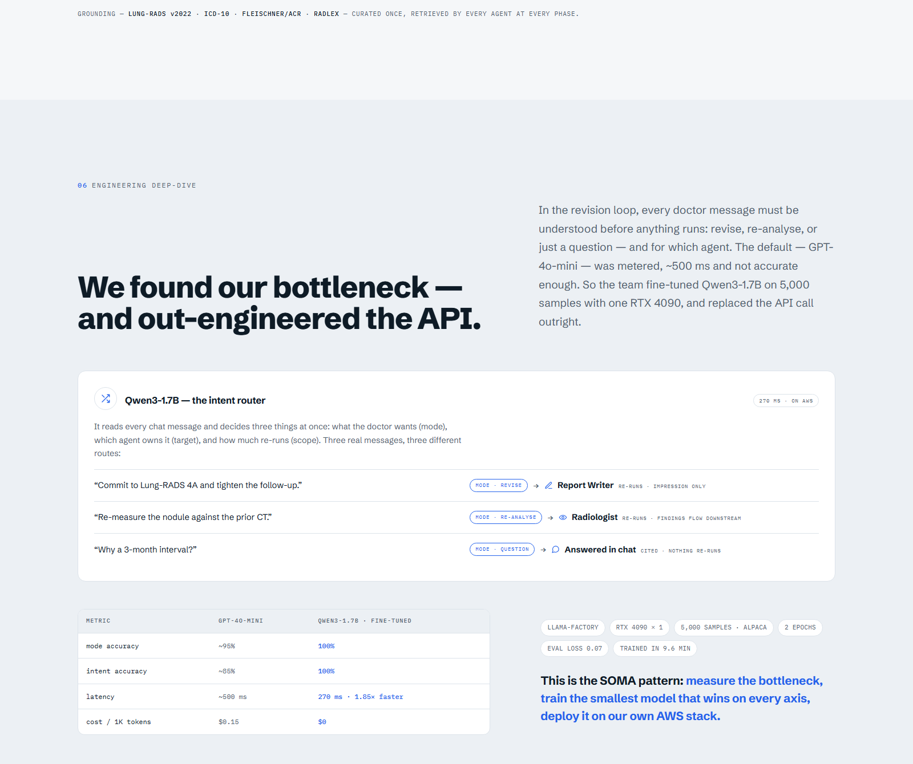

<div align="right"><a href="README.zh-CN.md">简体中文</a></div>

<p align="center"></p>

<p align="center"><b>From CT scan to a signed report — AI drafts, doctors decide.</b></p>

<p align="center">
  
  
  
  
  
  
</p>

<p align="center">
  <a href="https://soma-ai.org">Marketing site</a> ·
  <a href="https://app.soma-ai.org">Live demo</a>
</p>

SOMA is a clinician-centred medical AI platform for chest CT. It carries a scan from upload to a signed, evidence-cited radiology report while keeping a doctor in the loop at every step: the AI drafts, the radiologist reviews, revises, and approves. It was built by a four-person team — Ruixuan Liao, Mingzhe Cai, Siyu Chen, Kening Hu — and won the 🏆 **Impactful Tech Award** at USYD Coding Fest 2026 (School of Computer Science, 28 July 2026).

> **Public demo · synthetic data only.** Sign in at [app.soma-ai.org](https://app.soma-ai.org) with `judge@soma-ai.org` / `SomaFest2026`. All demo cases use synthetic data.

## ✨ Highlights

- **Interactive lesion segmentation** — SAM-Med2D (ONNX encoder + decoder) driven by point, box, and mask prompts. Mask decode runs in **5–17 ms** (measured), with **IoU ~0.92** whether the lesion is prompted by point or box.
- **Multi-agent reporting on a state machine** — an Orchestrator finite-state machine drives every case through `CREATED → ANALYZING → DRAFT_READY → REVISING → APPROVED`, coordinating four specialist agents: Radiologist (findings), Pathologist (differential + ICD-10), Report Writer (ACR-structured draft), and QC Reviewer (a quality gate scoring six categories).
- **Deterministic revision routing** — an Alignment router maps **22 revision intents** to the single agent that must re-run, so nothing regenerates silently when a doctor asks for a change.
- **Evidence retrieval (RAG)** — PubMedBERT **768-dim** embeddings in pgvector with an HNSW index over **441 curated guideline entries** (Lung-RADS, ICD-10, Fleischner/ACR, RadLex); **26–55 ms** retrieval per call (measured).
- **A fine-tuned intent router** — a Qwen3-1.7B model replaced GPT-4o-mini in the revision loop: **270 ms** with **100% mode/intent accuracy** on the team's eval (vs ~95% / ~85%), trained on 5,000 samples on a single RTX 4090.
- **Australian data residency** — deployed on AWS in Australian regions; Claude runs via AWS Bedrock with IAM instance-profile authentication, so no static API keys sit on the server.
- **Doctor-facing editing** — a streaming report editor (SSE), report version history with diff, and paged PDF export.

## 🏗 Architecture

<p align="center"></p>

<p align="center"><sub>Interactive segmentation feeds a stateful multi-agent reporting loop grounded by a curated medical retrieval layer.</sub></p>

The workflow is human-in-the-loop by design:

1. **Select a patient** and load a chest CT slice.
2. **Segment lesions interactively** with point and box prompts; the mask refines in real time.
3. **Draft a report** — the multi-agent pipeline analyses the case and produces an evidence-cited, ACR-structured draft, gated by the QC Reviewer.
4. **Review and revise** — the doctor edits the draft through chat; the Alignment router re-runs only the agent each request touches.
5. **Approve and export** — once the doctor approves, the report is exported to PDF.

## 📸 Screenshots

<p align="center"></p>

<p align="center"><sub>The segmentation workspace: point and box prompts return a lesion mask in milliseconds, with IoU reported per mask (real model output).</sub></p>

<p align="center"></p>

<p align="center"><sub>Four specialist agents behind an Orchestrator state machine, plus an Alignment router that only runs on revision — a doctor moves every case past Draft Ready.</sub></p>

## 📊 Engineering &amp; measured results

<p align="center"></p>

<p align="center"><sub>Numbers measured on the production path, not estimated: 441 guideline entries, 768-dim embeddings, 26–55 ms retrieval, IoU ~0.92, 270 ms intent routing, 100% mode/intent accuracy.</sub></p>

The revision loop was the bottleneck: every doctor message has to be understood — revise, re-analyse, or a plain question, and for which agent — before anything runs. The default GPT-4o-mini router was metered and not accurate enough, so the team fine-tuned Qwen3-1.7B on 5,000 samples with a single RTX 4090 and replaced the API call outright.

<p align="center"></p>

<p align="center"><sub>The self-hosted intent router reads each chat message and decides mode, target agent, and scope. Against GPT-4o-mini: 100% vs ~95% mode accuracy, 100% vs ~85% intent accuracy, 270 ms vs ~500 ms.</sub></p>

## 👤 My role

This was a team project. As **Project Lead & System Architect**, I set the system architecture and module boundaries, planned releases, and kept four contributors integrating against shared interfaces.

- I built the interactive part users touch: point/box correction, real-time mask refinement, image-and-mask persistence, and PDF report export.
- I wired the stateful multi-agent reporting pipeline together with the curated medical retrieval layer.
- I owned the shared interfaces the team built against, and coordinated releases across the four contributors.
- I tagged **v1.1.1** as the first user-testable research MVP.

## 🧰 Tech stack

| Layer | Technologies |
|-------|--------------|
| **Frontend** | React 19, Vite 7, Zustand, Tailwind, CodeMirror, jsPDF |
| **Backend** | Node.js + Express 5 (ESM), `@anthropic-ai/sdk`, `onnxruntime-node`, `sharp`, JWT auth |
| **Data** | Neon serverless PostgreSQL (ap-southeast-2, 9 tables), pgvector |
| **ML** | SAM-Med2D (ONNX), PubMedBERT embeddings served by a FastAPI sidecar, fine-tuned Qwen3-1.7B |
| **Infra** | Docker (backend, frontend, embedding server), Kubernetes / Kustomize / ArgoCD, GitLab CI |

## 🚀 Getting started

**Prerequisites:** Node.js. Set `ANTHROPIC_API_KEY`, `DATABASE_URL`, and `JWT_SECRET` via a `.env` file (never hardcode them). SAM-Med2D ONNX weights are downloaded separately and are not committed to the repo.

```bash
# Backend — serves :3000
cd backend && npm install && npm run dev

# Frontend — Vite dev server on :5173
cd frontend && npm install && npm run dev

# Embedding server — FastAPI on :8001
cd backend/embedding_server && pip install -r requirements.txt && uvicorn main:app --port 8001
```

## 🧪 Testing

About **256 tests across 21 files** (15 backend + 6 frontend).

```bash
npm test              # run the full suite
npm run test:mock     # run without API tokens
```

## 📌 Project status &amp; limitations

SOMA is a **v1.1.1 research MVP**. It is intended for **research and education only** — it is **not a medical device and not for clinical use**. The public demo runs on synthetic data.

## 🔒 Responsible use

> SOMA is a research prototype, not a clinical tool. It must not be used for clinical decision-making or on real patient data. All data in the public demo is synthetic.

## 📄 License

Released under the **MIT License** — see [`LICENSE`](LICENSE).

<p align="center"><sub>Built by <a href="https://github.com/SensLiao">Ruixuan "Sens" Liao</a> · USYD Advanced Computing (Honours)</sub></p>
