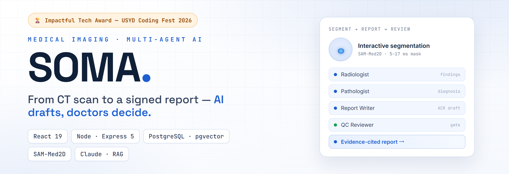
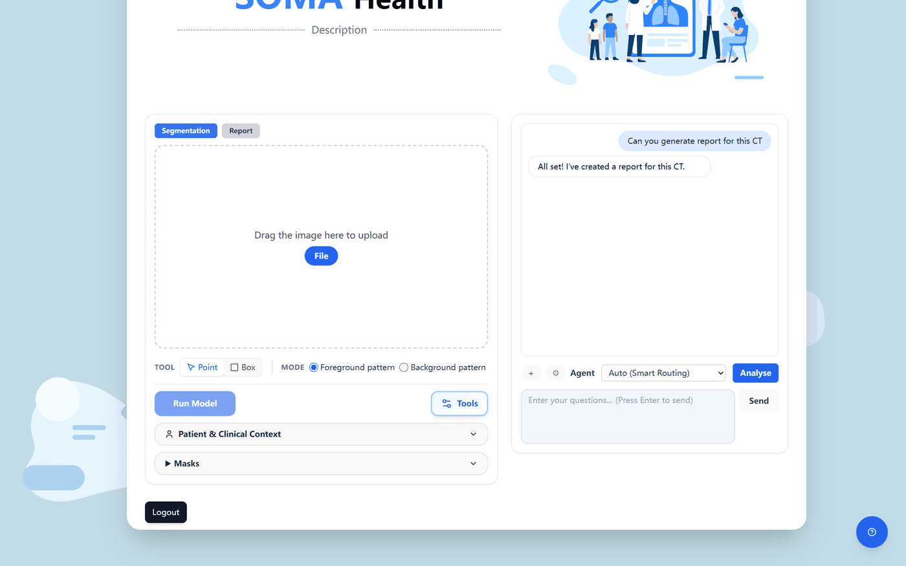
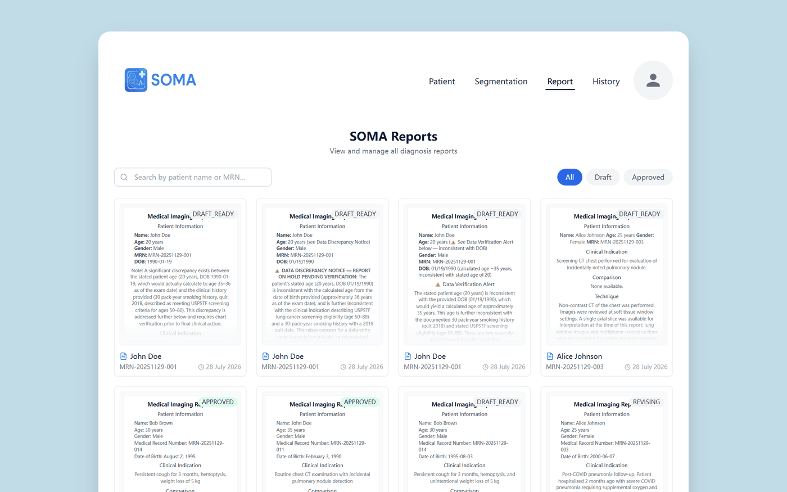
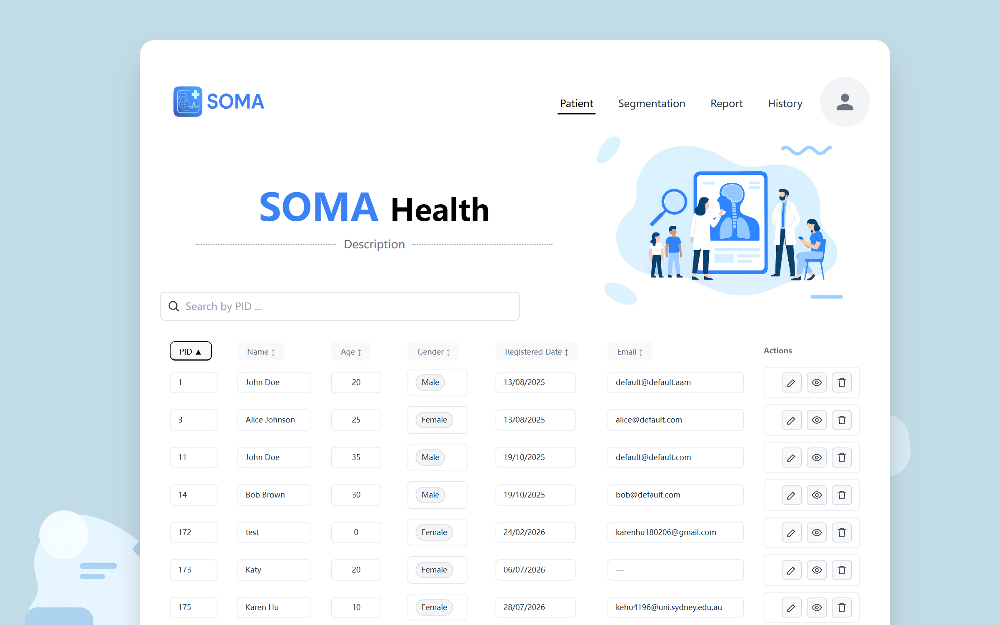
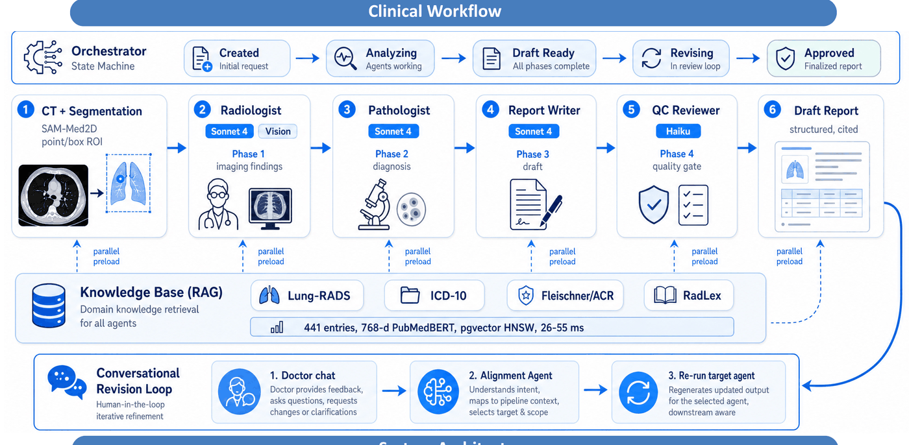
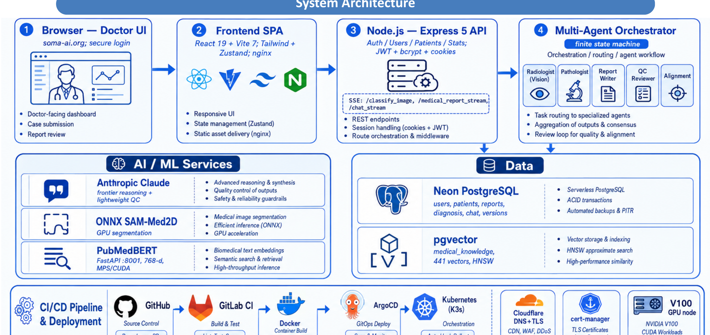
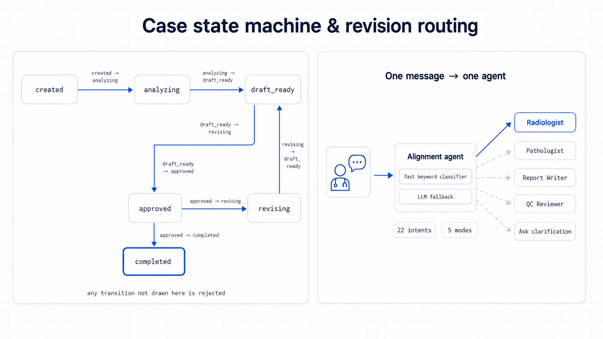

<div align="right"><a href="README.zh-CN.md">简体中文</a></div>

<p align="center"></p>

<p align="center">
  
  
  
  
</p>

SOMA is a clinician-centred medical AI platform for chest CT. It carries a scan from upload to a signed, evidence-cited radiology report while keeping a doctor in the loop at every step: the AI drafts, the radiologist reviews, revises, and approves. It was built by a four-person team — Ruixuan Liao, Mingzhe Cai, Siyu Chen, Kening Hu — and won the 🏆 **Impactful Tech Award** at USYD Coding Fest 2026 (School of Computer Science, 28 July 2026).

<p align="center">
  <a href="https://app.soma-ai.org">Live demo</a> ·
  <a href="https://soma-ai.org">Website</a> ·
  <a href="#-quick-start">Quick start</a> ·
  <a href="#-architecture">Architecture</a> ·
  <a href="#-configuration">Configuration</a>
</p>

> [!NOTE]
> **Public demo — synthetic data only.** Sign in at [app.soma-ai.org](https://app.soma-ai.org) with `judge@soma-ai.org` / `SomaFest2026`. Every case in the demo is synthetic; no real patient data is used anywhere in this project.

## 🧭 Overview

**Problem.** Radiology reporting is a bottleneck, and the obvious AI answer — generate the report — fails on the two things clinicians actually need. A generated report that cannot show *which guideline* a finding came from is not reviewable, and one that regenerates wholesale when the doctor asks for a small change is not editable. Both make the AI a black box the radiologist has to check line by line, which is slower than writing it themselves.

**Solution.** SOMA makes the draft both traceable and surgically revisable. Findings are grounded in a curated guideline corpus through vector retrieval, so each claim carries evidence. Reporting runs as four specialist agents on an explicit state machine rather than one prompt, so a case has a visible position in the workflow. And when a doctor asks for a change, an alignment router classifies the request into one of 22 intents and re-runs only the agent that intent touches — nothing else regenerates silently.

**Scope.** SOMA is a **research prototype built for a hackathon**, not a clinical product: it is not a medical device, is not for clinical use, and runs on synthetic data. It is a full-stack demonstration of the human-in-the-loop pattern (SPA, API, multi-agent orchestration, RAG, containerised deployment), not a validated diagnostic system.

## ✨ Highlights

- **Interactive lesion segmentation** — SAM-Med2D (ONNX encoder + decoder) driven by point, box, and mask prompts. Mask decode runs in **5–17 ms** (measured), with **IoU ~0.92** whether the lesion is prompted by point or box.
- **Multi-agent reporting on a state machine** — an Orchestrator finite-state machine drives every case through `created → analyzing → draft_ready → revising → approved → completed`, with illegal transitions rejected rather than tolerated, coordinating four specialist agents.
- **Deterministic revision routing** — an Alignment agent classifies each doctor message into **22 revision intents** and re-runs only the agent that message actually touches, so an edit never silently regenerates the whole report.
- **Evidence retrieval (RAG)** — PubMedBERT **768-dim** embeddings in pgvector with an HNSW index over **441 curated guideline entries** (Lung-RADS v2022, ICD-10 respiratory, Fleischner/ACR, RadLex chest), retrieved in **26–55 ms** per call (measured).
- **A doctor-facing editing loop** — SSE-streamed report editing in CodeMirror, full version history with diff, and paged PDF export.
- **Australian data residency** — deployed on AWS in Australian regions; Claude runs through AWS Bedrock with IAM instance-profile authentication, so no static API keys sit on the server.
- **Ships as containers** — backend, frontend and the embedding sidecar each have a Dockerfile, with Kustomize base + overlay manifests and a GitOps CI pipeline behind the live demo.

## 📸 Screenshots

<p align="center"></p>
<p align="center"><sub>The segmentation workspace — point/box tools, patient and clinical context, and the assistant that drives the multi-agent report pipeline.</sub></p>

<p align="center"></p>
<p align="center"><sub>Report management — every case tracked through Draft Ready → Revising → Approved, with evidence-cited findings and patient context.</sub></p>

<p align="center"></p>
<p align="center"><sub>The patient workspace. Live at <a href="https://app.soma-ai.org">app.soma-ai.org</a> — public demo, synthetic data.</sub></p>

## 🏗 Architecture

<p align="center"></p>

<p align="center"><sub>The clinical workflow — interactive CT segmentation feeds a five-agent reporting pipeline on an Orchestrator state machine, grounded by a curated knowledge base (RAG), with a human-in-the-loop revision loop.</sub></p>

The workflow is human-in-the-loop by design. A CT slice and its segmentation mask enter the pipeline; specialist agents then hand the case along — Radiologist to Pathologist to Report Writer — before a QC Reviewer gates the draft. Every agent reads from the same curated knowledge base, so findings, differentials, and the final wording all cite the same guideline entries. The doctor is the last step, not a spectator.

<p align="center"></p>

<p align="center"><sub>The system architecture — from the doctor's browser through the React SPA and Node/Express API to the multi-agent orchestrator, AI/ML services, PostgreSQL + pgvector, and the CI/CD pipeline.</sub></p>

The system underneath is a thin path from browser to orchestrator. The React SPA talks to a Node.js + Express 5 API, which owns authentication and case state and delegates every clinical step to the multi-agent orchestrator. Below that sit the AI/ML services — SAM-Med2D for segmentation, Claude for the specialist agents, a FastAPI sidecar serving PubMedBERT embeddings — and the data layer, PostgreSQL with pgvector holding cases, reports, masks, and the guideline index.

## 🔄 The reporting pipeline

**The state machine.** Every case has exactly one position, and the orchestrator rejects any transition not in this table:

| State | Meaning | May move to |
| --- | --- | --- |
| `created` | Case opened, nothing analysed yet | `analyzing` |
| `analyzing` | The agent pipeline is running | `draft_ready` |
| `draft_ready` | A QC-gated draft exists, awaiting the doctor | `revising`, `approved` |
| `revising` | A doctor request is being applied by one agent | `draft_ready` |
| `approved` | The doctor signed off | `completed`, `revising` |
| `completed` | Terminal | — |

<p align="center"></p>
<p align="center"><sub>The case state machine and the revision router — one message resolves to one intent, and one intent re-runs one agent.</sub></p>

**The agents.** Each is a separate module with its own system prompt and model tier:

| Agent | Role in the pipeline |
| --- | --- |
| **Radiologist** | Reads the slice and mask, produces structured findings. |
| **Pathologist** | Builds the differential and assigns ICD-10 coding. |
| **Report Writer** | Renders findings and differential into an ACR-structured draft. |
| **QC Reviewer** | Scores the draft as a quality gate before a human ever sees it. |
| **Alignment** | Not in the linear pipeline — it classifies doctor messages and routes revisions. |

**How a revision is routed.** The Alignment agent first runs a keyword-based fast classifier, escalating to the LLM when that is not decisive, and resolves the message into a **mode** (`question`, `info`, `revision`, `approval`, `unclear`) and one of **22 intents** — from `typo_fix` and `format_change`, through `missing_finding` and `measurement_error`, to `reconsider_diagnosis` and `rewrite_impression`. The intent determines which single agent re-runs. A typo never re-invokes the Radiologist; a disputed diagnosis does.

**How evidence is attached.** When analysis starts, the orchestrator fires three retrieval queries in parallel — classification, terminology, and coding — against the pgvector index, keeps the top 3 of each above a 0.45 similarity floor, and merges them into a shared context of up to 8 entries that every agent in the case reads from. That shared context is why the findings, the differential, and the final wording cite the same guidelines instead of three different ones.

## 📊 Engineering deep-dive: replacing the router

The revision loop was the bottleneck: every doctor message has to be understood — revise, re-analyse, or a plain question, and for which agent — before anything runs. The default GPT-4o-mini router was metered and not accurate enough, so the team fine-tuned **Qwen3-1.7B** on 5,000 samples with a single RTX 4090 and replaced the API call outright: **270 ms** with **100% mode/intent accuracy** on the team's evaluation set, against GPT-4o-mini's ~500 ms and ~95% / ~85%. The fine-tuning work lives outside this repository; what ships here is the routing contract the model was trained to satisfy.

## 🚀 Quick start

### Requirements

- **Node.js 20+** and **npm** (backend and frontend)
- **Python 3.12** (only for the local embedding sidecar)
- A **PostgreSQL database with the `pgvector` extension** — the project uses Neon serverless in `ap-southeast-2`
- An **Anthropic API key** for the agents
- Optional: **Docker** if you would rather run the three services as containers

### 1. Configure the environment

Copy `.env.example` and fill it in. The variables the code actually reads:

| Variable | Used by | Notes |
| --- | --- | --- |
| `DEV_DATABASE_URL` | backend | PostgreSQL connection string, pgvector enabled. **This is the name the code reads** — `.env.example` still calls it `DATABASE_URL`. |
| `ANTHROPIC_API_KEY` | backend agents | Required unless you only exercise non-agent routes. |
| `JWT_SECRET` | backend auth | Set it — there is a development fallback you should not ship. |
| `PORT` | backend | Defaults to 3000. |
| `SKIP_MODELS` | backend | `true` skips loading the ONNX segmentation models at boot — useful for API-only work. |
| `EMBEDDING_PROVIDER` | backend | `local` (PubMedBERT sidecar, 768-d, default), `voyage`, or `mock`. |
| `LOCAL_EMBEDDING_URL` | backend | Where the FastAPI sidecar listens, e.g. `http://127.0.0.1:8001`. |
| `VOYAGE_API_KEY` | backend | Only when `EMBEDDING_PROVIDER=voyage`. |
| `USE_GPU` | embedding sidecar | `1` to use CUDA; otherwise MPS or CPU is selected automatically. |
| `VITE_API_BASE` | frontend | API base URL the SPA calls. |

### 2. Start the three services

```bash
# Backend — serves :3000
cd backend && npm install && npm run dev

# Frontend — Vite dev server on :5173
cd frontend && npm install && npm run dev

# Embedding sidecar — FastAPI on :8001
cd backend/embedding_server && pip install -r requirements.txt && uvicorn main:app --port 8001
```

### 3. Prepare the database

```bash
cd backend
npm run setup:dev-db          # creates pgvector + the case/knowledge tables
node scripts/migrate-iter5-embedding-768.mjs   # widen embeddings 512 -> 768 + HNSW index
node scripts/import-knowledge.mjs              # load the 441 guideline entries
```

> [!IMPORTANT]
> Run the iter5 migration before importing knowledge. `setup:dev-db` creates the embedding column at 512 dimensions; the default PubMedBERT provider emits 768, and nothing enforces the ordering for you.

### What you should see

The backend logs its port and — unless `SKIP_MODELS=true` — loads the SAM-Med2D ONNX models at boot. `GET /api/health` returns a health payload, and the sidecar's `GET /health` reports the model, its 768 dimension, and the device it selected (`cuda`, `mps`, or `cpu`); it reports `"status": "loading"` until the ~400 MB model finishes downloading on first run. Open the Vite URL, sign in, and the patient list loads from your database.

## 📖 Common workflows

### Produce a report for one case

1. **Select a patient** and load a chest CT slice.
2. **Segment interactively** — point and box prompts refine the mask in real time.
3. **Draft the report** — the agent pipeline analyses the case and returns an evidence-cited, ACR-structured draft, gated by the QC Reviewer.
4. **Review and revise** — edit through chat; the Alignment router re-runs only the agent your request touches.
5. **Approve and export** — once approved, the report exports to PDF.

### Work on the API without the ML models

```bash
SKIP_MODELS=true npm run dev     # backend boots without loading ONNX weights
```

### Swap the embedding provider

```bash
EMBEDDING_PROVIDER=mock npm run dev    # deterministic 768-d vectors, no sidecar, no API cost
```

`local` (the PubMedBERT sidecar) is the default; `voyage` uses the Voyage API; `mock` is for offline development.

### Rebuild the knowledge base

```bash
cd backend
CLEAR_FIRST=1 node scripts/import-knowledge.mjs   # wipe and re-import all 441 entries
node scripts/import-lung-rads.mjs                 # Lung-RADS v2022 only
```

### Seed demo data

```bash
node scripts/seed-mock-clinical-data.mjs
node scripts/seed-demo-diagnoses.mjs
```

## 🗄 Data model

Nine tables in PostgreSQL. The core four (`users`, `publication`, `patients`, `segmentations`) are created at boot; the rest come from the setup and migration scripts:

| Table | Holds |
| --- | --- |
| `users` · `publication` | Clinician accounts and their publications |
| `patients` | Patient records with MRN and clinical context (indication, smoking history, prior imaging, exam type and date) |
| `segmentations` | Stored masks and their source images |
| `diagnosis_records` | One row per case: report content, status, and clinical context |
| `report_versions` | Full version history behind the diff view |
| `chat_history` | The doctor-assistant revision conversation |
| `doctor_patient` | Assignment between clinicians and patients |
| `medical_knowledge` | The 441 guideline entries with 768-d pgvector embeddings and an HNSW index |

The knowledge base is assembled from seven curated JSON sources in `backend/data/`: ICD-10 respiratory (149 + 50 entries), RadLex chest (106 + 43), clinical differentials (38), clinical guidelines (36), and Lung-RADS v2022 (19) — 441 in total.

## 🚢 Deployment

Each service ships as a container: `backend/Dockerfile` (Node 20 slim, health-checked on `/api/health`), `frontend/Dockerfile` (two-stage Vite build served by nginx), and `backend/embedding_server/Dockerfile` (Python 3.12 slim, port 8001).

Kubernetes manifests live in [`k8s/`](k8s/) as a Kustomize base plus a homelab overlay: a `soma-ai` namespace, backend and frontend Deployments and Services, and a Traefik Ingress with TLS terminating `soma-ai.org` (`/api` to the backend, `/` to the frontend) and `api.soma-ai.org`. The pipeline in `.gitlab-ci.yml` runs tests, builds and pushes both images, then updates the overlay image tag and commits it back for GitOps sync.

> [!NOTE]
> These manifests describe the deployment behind the live demo. They pin an internal registry and a homelab cluster, and there is no manifest for the embedding sidecar — treat them as a working reference rather than a turnkey install.

## 🧪 Testing

```bash
cd frontend && npm run test:run    # Vitest + Testing Library (jsdom)
cd backend && npm test             # hand-rolled Node scripts
```

**21 test files — 15 backend, 6 frontend.** The frontend suite runs under Vitest with jsdom. The backend suite is deliberately framework-free: plain Node scripts with `console` assertions and exit codes.

Two honest caveats. The backend runner currently executes 2 of the 14 backend test files (the rest run individually, for example `node tests/database.test.js`), and the agent suites skip themselves when `ANTHROPIC_API_KEY` is unset rather than mocking the API — so a green backend run in an unkeyed environment means "nothing was exercised", not "everything passed". CI reflects that: both test jobs are marked `allow_failure`.

## 🖥 Compatibility

| Component | Support |
| --- | --- |
| Node.js | 20 (CI and the Docker images build on `node:20`) |
| Python | 3.12 for the embedding sidecar |
| Database | PostgreSQL with `pgvector` (developed against Neon serverless, `ap-southeast-2`) |
| Browsers | Modern evergreen browsers (React 19 + Vite 7) |
| Deployment | Docker; Kubernetes via Kustomize (Traefik ingress, cert-manager) |
| Windows dev | The backend `test:mock` script uses a POSIX env prefix — use `set` / `$env:` or Git Bash |

## 🧰 Tech stack

| Layer | Technologies |
| --- | --- |
| **Frontend** | React 19, Vite 7, react-router 7, Zustand, Tailwind, CodeMirror, jsPDF |
| **Backend** | Node.js 20 + Express 5 (ESM), `@anthropic-ai/sdk`, `onnxruntime-node`, `sharp`, `multer`, JWT + bcrypt |
| **Data** | PostgreSQL (Neon serverless, `ap-southeast-2`, 9 tables), pgvector with HNSW |
| **ML** | SAM-Med2D (ONNX), PubMedBERT embeddings via a FastAPI sidecar, Claude through the Anthropic SDK / AWS Bedrock |
| **Infra** | Docker, Kubernetes + Kustomize, Traefik, GitLab CI (GitOps) |

## 📊 Project status

- **Working end to end** — interactive segmentation, the multi-agent pipeline and its state machine, RAG retrieval over the 441-entry knowledge base, streaming chat revision, version history with diff, and PDF export. The public demo runs this code on synthetic data.
- **Research-grade, not production-hardened** — this was built to a hackathon deadline. Access control, input validation and rate limiting are not complete across the API; the open items are tracked candidly in [`TODO_ROADMAP.md`](TODO_ROADMAP.md), which doubles as the project's own code-review backlog.
- **Not shipped here** — the fine-tuned Qwen3-1.7B router (trained separately) and any real clinical data. Deploy this as a demo on synthetic data, not as a service.

## 📌 Limitations and intended use

SOMA is a research prototype intended for **research and education only**. It is **not a medical device**, has not been validated or approved for clinical use, and must not inform clinical decision-making. It was developed and demonstrated on synthetic data; performance on real chest CT, on other imaging protocols, or across other populations has not been established.

## 🔒 Responsible use

> Do not deploy SOMA against real patient data. The public demo uses synthetic cases only, and the credentials above are published deliberately for evaluation.

## 👤 My role

This was a team project. As **Project Lead & System Architect**, I set the system architecture and module boundaries, planned releases, and kept four contributors integrating against shared interfaces.

- I built the interactive part users touch: point/box correction, real-time mask refinement, image-and-mask persistence, and PDF report export.
- I wired the stateful multi-agent reporting pipeline together with the curated medical retrieval layer.
- I owned the shared interfaces the team built against, and coordinated releases across the four contributors.
- I drove the project to its first user-testable research MVP.

## 🙋 Getting help

- **Running it locally** — start with [Quick start](#-quick-start); most first-run problems are the `DEV_DATABASE_URL` name or the 512-to-768 migration ordering.
- **Bugs** — open a GitHub issue with your Node version, the failing command, and the server log.
- **Known gaps and planned work** — read [`TODO_ROADMAP.md`](TODO_ROADMAP.md) first; it is an honest list of what is unfinished.

## 📄 License

Released under the **MIT License** — see [`LICENSE`](LICENSE).

<p align="center"><sub>Built by <a href="https://github.com/SensLiao">Ruixuan "Sens" Liao</a> · USYD Advanced Computing (Honours)</sub></p>
